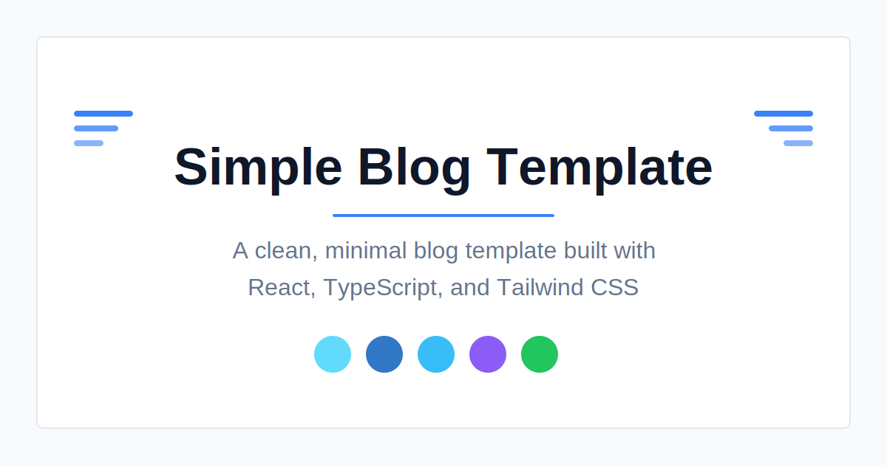

# Simple Blog

A clean, minimal blog template built with React, TypeScript, and Tailwind CSS. Focus on writing content with Markdown while enjoying modern development tools and a responsive design.

<p align="center">
  
</p>

[**Live Demo**](https://blogmaker-template.vercel.app/)

## ✨ Features

- 📝 **Markdown-based content** - Write posts in Markdown with frontmatter
- 🎨 **Clean, minimal design** - Beautiful typography and spacing
- 🌙 **Dark/light mode** - Automatic theme detection with manual toggle
- 🔍 **SEO optimized** - Meta tags, Open Graph, and structured data
- 📱 **Fully responsive** - Works great on all devices
- 🚀 **Fast performance** - Built with Vite for quick load times
- 🧩 **Component library** - Built with shadcn/ui components
- 🔄 **Auto-imports posts** - No need to register new posts in code
- 📊 **100% test coverage** - Unit and integration tests with Vitest
- 🔧 **Easy customization** - Central config file for most settings

## 🚀 Quick Start

```bash
# Clone the repository
git clone https://github.com/chrismannina/blogmaker-template.git my-blog

# Navigate to project directory
cd my-blog

# Install dependencies
npm install

# Start the development server
npm run dev
```

Visit `http://localhost:8080` in your browser to see your blog.

## 📝 Creating Blog Posts

1. Create a new Markdown file in the `src/posts` directory with a numbered prefix (e.g., `06-my-first-post.md`)
2. Add frontmatter and content:

```markdown
---
title: My First Blog Post
date: 2025-08-01
excerpt: A brief summary of what this post is about
tags: ['react', 'tutorial']
coverImage: https://images.unsplash.com/photo-example
---

# My First Blog Post

Write your content here using Markdown...
```

Your post will automatically appear in the blog!

## 🛠️ Customization

### Configuration

Edit `src/config/blog.config.ts` to customize:

- Blog title, description, and author info
- Navigation links
- Theme colors and dark mode settings
- Date formats
- Footer content

### Styling

This template uses Tailwind CSS for styling. Customize:

- Global styles in `src/index.css`
- Component-specific styles in their respective files
- Theme colors in `tailwind.config.js`

## 📋 Project Structure

```
simple-blog-template/
├── public/               # Static assets
├── src/
│   ├── components/       # React components
│   │   └── ui/           # UI components (shadcn/ui)
│   ├── config/           # Configuration files
│   ├── contexts/         # React contexts (theme, etc.)
│   ├── lib/              # Utility functions
│   ├── pages/            # Page components
│   ├── posts/            # Markdown blog posts
│   └── styles/           # CSS files
├── tests/                # Test files
│   ├── unit/             # Unit tests
│   └── integration/      # Integration tests
└── scripts/              # Utility scripts
```

## 📦 Deployment

### Vercel (Recommended)

1. Push your repo to GitHub
2. Import it to [Vercel](https://vercel.com)
3. Deploy with one click

Or use the CLI:

```bash
npm install -g vercel
vercel
```

### Netlify

1. Push your repo to GitHub
2. Import it to [Netlify](https://netlify.com)
3. Configure build settings:
   - Build command: `npm run build`
   - Publish directory: `dist`

### GitHub Pages

1. Update `vite.config.ts` with your repo name:
   ```typescript
   base: '/your-repo-name/',
   ```
2. Add deployment script to `package.json`:
   ```json
   "deploy": "gh-pages -d dist"
   ```
3. Install gh-pages: `npm install --save-dev gh-pages`
4. Build and deploy: `npm run build && npm run deploy`

## 📚 Documentation

The blog itself contains comprehensive documentation:

1. [Welcome](https://blogmaker-template.vercel.app/blog/01-welcome) - Introduction
2. [Getting Started](https://blogmaker-template.vercel.app/blog/02-getting-started) - Setup guide
3. [Writing Content](https://blogmaker-template.vercel.app/blog/03-writing-content) - Creating posts
4. [Customizing](https://blogmaker-template.vercel.app/blog/04-customizing) - Personalization
5. [Deploying](https://blogmaker-template.vercel.app/blog/05-deploying) - Publishing your blog

Additional documentation in the [USAGE.md](./USAGE.md) file.

## ⚡ Performance

This template is optimized for performance:

- Fast build times with Vite
- Optimal bundle sizes
- Efficient image loading
- Minimal dependencies

## 🧪 Testing

Run tests with:

```bash
# Run all tests
npm test

# Watch mode
npm run test:watch

# With UI
npm run test:ui

# Coverage report
npm run test:coverage
```

## 📄 License

[MIT License](LICENSE)

## 🙏 Acknowledgements

- [React](https://reactjs.org/)
- [TypeScript](https://www.typescriptlang.org/)
- [Tailwind CSS](https://tailwindcss.com/)
- [shadcn/ui](https://ui.shadcn.com/)
- [Vite](https://vitejs.dev/)
- [Vitest](https://vitest.dev/)
- [React Router](https://reactrouter.com/)
- [gray-matter](https://github.com/jonschlinkert/gray-matter)
- [react-markdown](https://github.com/remarkjs/react-markdown)

---

Built with ❤️ by [Chris Mannina](https://github.com/chrismannina)
